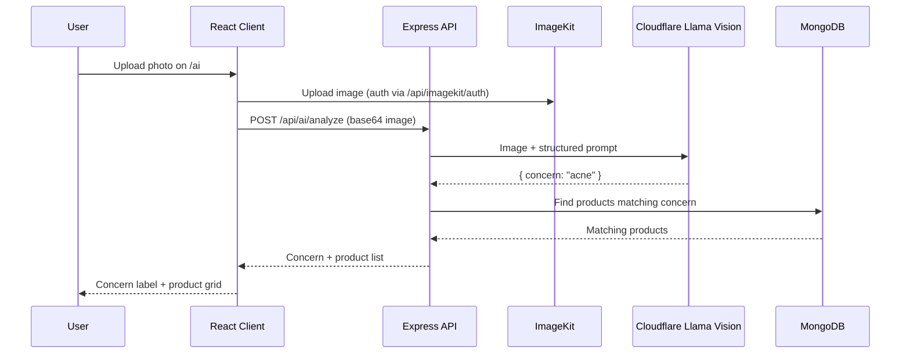

<div align="center">

# Skinify 🌿

**AI-powered skincare & wellness e-commerce platform**

Upload a photo. Let AI detect your skin concern. Shop products made for you.

[](https://skinify-plum.vercel.app)


[Live Demo](https://skinify-plum.vercel.app) • [Features](#-features) • [How the AI Works](#-how-the-ai-works) • [Tech Stack](#-tech-stack) • [Getting Started](#-getting-started) • [API](#-api-routes)

</div>

---

## 📌 Overview

Shopping for skincare and haircare usually means guessing which product fits your problem. **Skinify** removes the guesswork: a user uploads a face, hair, or body photo, a Llama vision model on Cloudflare identifies the likely concern (acne, dryness, hairfall, and so on), and the store instantly shows matching products, with a complete cart, checkout, and order flow behind it.

It is a full-stack MERN application: React (Vite) client, Express REST API, MongoDB, JWT auth, ImageKit for image delivery, and Cloudflare's Llama vision model for image analysis.

<!-- Add 2-3 screenshots or a short GIF here (home, AI upload result, cart).

-->

## ✨ Features

| | Feature | Details |
|---|---|---|
| 🤖 | **AI skin analysis** | Upload a face, hair, or body photo; a Llama vision model (Cloudflare) detects the concern |
| 🎯 | **Concern-based recommendations** | Products filtered by the AI-detected concern |
| 🗂️ | **Category browsing** | Skincare, Haircare, and Weight Loss |
| 🛒 | **Cart & checkout** | Quantity controls, address form, COD and Prepaid order types |
| 📦 | **Order history** | Past orders with status and product breakdown |
| 🔐 | **JWT authentication** | Register/login with protected routes and hashed passwords |
| 🖼️ | **ImageKit CDN** | Optimized delivery for product and user images |
| 🎨 | **Luxury dark UI** | Editorial look with Cormorant Garamond type and gold accents |

## 🤖 How the AI Works



The backend asks the model to return only JSON, for example `{ concern: string }`, then uses that value to query products.

> ⚠️ Skinify's AI suggestions are for product discovery only and are not medical or dermatological advice.

## 💻 Tech Stack

| Layer | Technology |
|---|---|
| **Frontend** | React.js (Vite), Axios, React Context API |
| **Styling** | Custom CSS, Cormorant Garamond + DM Sans |
| **Backend** | Node.js, Express.js |
| **Database** | MongoDB (Mongoose) |
| **Auth** | JWT (jsonwebtoken) |
| **AI** | Cloudflare AI, Llama vision model |
| **Media** | ImageKit.io CDN |
| **Frontend hosting** | Vercel |

## 📁 Project Structure

```text
skinify/
├── frontend/                # React + Vite client
│   └── src/
│       ├── api/             # Axios instance
│       ├── components/      # Navbar, ProductCard
│       ├── context/         # CartContext
│       └── pages/           # Home, Products, AIUpload, Cart,
│                            # Checkout, Orders, Login, Register
└── Backend/                 # Express API
    ├── models/              # User, Product, Order
    ├── routes/              # auth, products, orders, ai, imagekit
    ├── middleware/          # authMiddleware (JWT)
    └── index.js
```

## 🚀 Getting Started

### Prerequisites

- Node.js 18+
- MongoDB (local or Atlas)
- Cloudflare account with API access to Workers AI
- ImageKit account (public key, private key, URL endpoint)

### 1. Clone

```bash
git clone https://github.com/Aryan7575/skinify.git
cd skinify
```

### 2. Backend

```bash
cd Backend
npm install
```

Create `Backend/.env`:

```env
PORT=5000
MONGO_URI=your_mongodb_connection_string
JWT_SECRET=your_jwt_secret_key
CLOUDFLARE_ACCOUNT_ID=your_cloudflare_account_id
CLOUDFLARE_API_TOKEN=your_cloudflare_api_token
IMAGEKIT_PUBLIC_KEY=your_imagekit_public_key
IMAGEKIT_PRIVATE_KEY=your_imagekit_private_key
IMAGEKIT_URL_ENDPOINT=https://ik.imagekit.io/your_id
```

```bash
npm run dev
```

### 3. Frontend

```bash
cd frontend
npm install
```

Create `frontend/.env`:

```env
VITE_API_URL=http://localhost:5000/api
```

```bash
npm run dev
```

The app runs at `http://localhost:5173`.

## 📡 API Routes

| Method | Endpoint | Description | Auth |
|---|---|---|---|
| `POST` | `/api/auth/register` | Register a new user | ❌ |
| `POST` | `/api/auth/login` | Log in, returns a JWT | ❌ |
| `GET` | `/api/products` | List all products | ❌ |
| `GET` | `/api/products?category=Skincare` | Filter by category | ❌ |
| `POST` | `/api/ai/analyze` | AI skin/hair analysis and recommendations | ❌ |
| `POST` | `/api/orders` | Place an order | ✅ |
| `GET` | `/api/orders/my` | Current user's orders | ✅ |
| `GET` | `/api/imagekit/auth` | ImageKit upload auth token | ❌ |

<details>
<summary><b>Product schema</b></summary>

```js
{
  name: "Niacinamide Serum 10%",
  price: 499,
  image: "https://ik.imagekit.io/...",
  category: "Skincare",   // Skincare | Haircare | Weight Loss
  concern: "acne"         // matched by AI analysis
}
```

</details>

## 🔐 Authentication Flow

```text
Register → POST /api/auth/register → password hashed, user stored in MongoDB
Login    → POST /api/auth/login    → JWT returned, stored in localStorage
         → sent as  Authorization: Bearer <token>  on protected routes
```

## 🖥️ Pages

| Page | Path | Description |
|---|---|---|
| Home | `/home` | Hero slider, best sellers, footer |
| Products | `/products` | Category-filtered catalog |
| AI Recommend | `/ai` | Upload image → analysis → recommendations |
| Cart | `/cart` | Quantity controls and order summary |
| Checkout | `/checkout` | Address form, COD/Prepaid toggle |
| Orders | `/orders` | Order history with status badges |
| Login / Register | `/login`, `/register` | JWT authentication |

<details>
<summary><b>🎨 Design system</b></summary>

| Token | Value |
|---|---|
| Background | `#0e0e0e` |
| Card | `#161616` |
| Border | `#2a2a2a` |
| Gold accent | `#c8a97e` |
| Text primary | `#f0ece4` |
| Text muted | `#888888` |
| Display / body font | Cormorant Garamond / DM Sans |

</details>

## 📄 About

Built as the final-year project for the B.Sc. Computer Science program at R.D. & S.H. National College, Bandra, Mumbai (2025–2026).

## 👤 Author

**Aryan Ramvilas Vishwakarma**
B.Sc. Computer Science Graduate · Full Stack (MERN) Developer · Mumbai

[GitHub](https://github.com/Aryan7575) • [Live Demo](https://skinify-plum.vercel.app)

---

<div align="center">Made with 🤎 in Mumbai</div>
